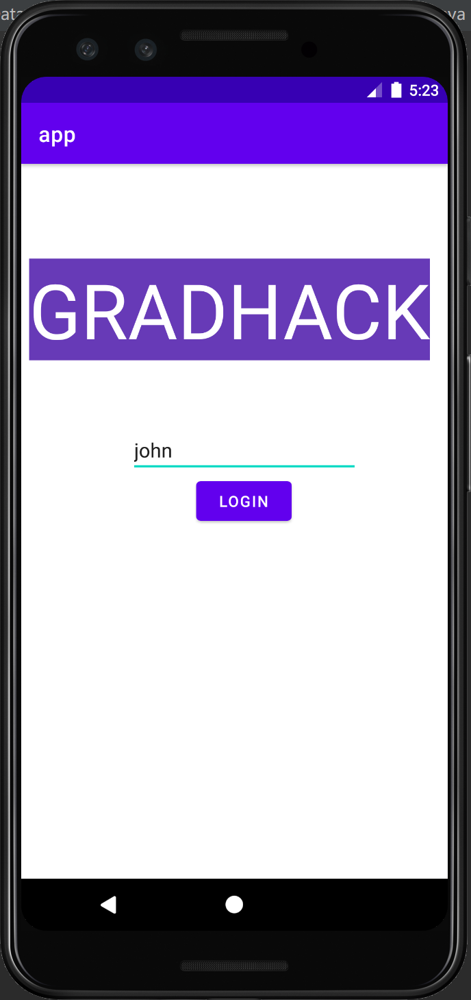
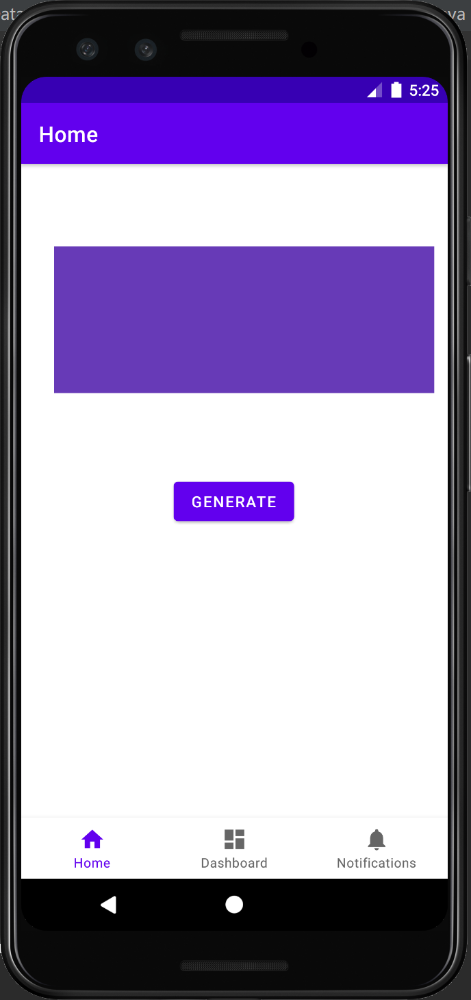
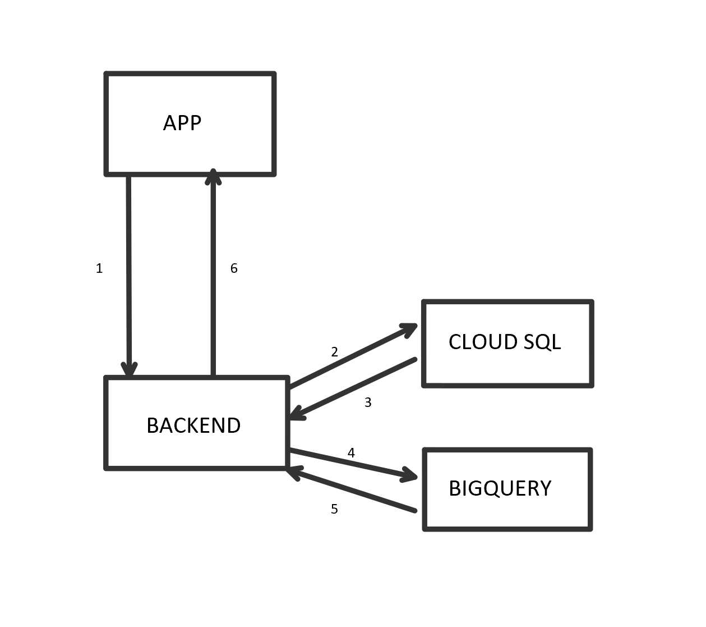

# GUIDELINE

## 0.PREREQUISITE

In oreder to run the project you will need the following resources and get it well configured

* jdk 1.8
* maven
* android studio
    - Make sure choose to install android sdk(version should not matter, I only install android 11.0) and android emulator during the setup process.
* python 3.x 
    - If you are not using anaconda, make sure you hava numpy, pandas and random. 
* register a google cloud platform account
    - New joiner will have 300$ credit which should be enough.
* git
* handy ide(I am using spyder for python, intelij for java and of course android studio for android app)

## 1.CLONE PROJECT FROM GITHUB

 Clone the project using git.


## 2.CREATE MODEL
* run generate_data.py. If no error occurs, you should be able to see a new file called data.csv under the folder.
* navigate Bigquery on google cloud platform, create a dataset under your project you could select a location that is close to you.
* under that dataset create a table and upload data.csv which you just create. In the schema section, check auto detect and leave every thing default. 
* After successfully upload the data onto Bigquey, you could use bigquery ml to help you train the model. Simplely run the query under query editor. Make sure you replace your &lt;project_id>, &lt;dataset_name>, &lt;table_name>, and &lt;model_name> with yours.
```
create model 
`<dataset_name>.<model_name>` 
options(model_type='linear_reg', input_label_cols = ['credit'] ) 
as 
select * from `<project_id>.<dataset_name>.<table_name>`
```
* If success, make a prediction based on our model by running the query, you should be able to see the result.
```
SELECT 
predicted_credit 
FROM 
ML.PREDICT(MODEL `<dataset_name>.<model_name>`, (select 20 as transaction, 12000 as income, 0 as overdue, 2 as level))
```

## 3.SET UP A DATABASE
* (you could install mysql locally and skip this part)navigate to cloud sql and create a mysql instance
* create a database, a table, and insert some records
```
create database gradhack;

use gradhack;

CREATE TABLE IF NOT EXISTS `user_credit`(
   `name` CHAR(8),
   `transaction` INT,
   `income` INT,
   `overdue` INT,
   `level` INT,
   `credit` DOUBLE DEFAULT 0.0,
   PRIMARY KEY ( `name` )
)ENGINE=InnoDB DEFAULT CHARSET=utf8;
```  
```
INSERT INTO `user_credit` VALUES ('John', 20, 4000, 0, 5, 0), ('Kate', 10, 2000, 5, 3, 0), ('David', 40, 6000, 0, 7, 0);
```

## 4.RUN THE BACKEND APPLICATION
* Open gradhack with your java ide, it is a springboot project, so make sure you have correctlly configued jdk and maven
* While your maven is resloving the dependencies, you can create a service account on google cloud platform. It gives your accesses to your project resources. Visit [create credential](https://cloud.google.com/bigquery/docs/reference/libraries?hl=en_US#setting_up_authentication).
* Under the project folder, edit src/main/resources/application.yml. For spring.datasource.url, replace the ip with your database ip, For config.projectId, replace it with your gcp project id, for config.credential replace it with your credential file name. Also, you need to place your json file under src/main/resources/static
* Run the project, if success, visiting [http://127.0.0.1:8081/test/app](http://127.0.0.1:8081/test/app) should return success as response

## 5.RUN THE ANDORID APPLICATION
* Open the app folder with andorid and wait for the gradle to compile.
* Under the project folder, edit src/main/java/com/example/app/ui/home/HomeFragment.java. In line 53, replace the ip with your ip.
* In the first page, enter one of the name that you inserted into the mysql table, then click 'login'. In the next page, click 'generate', it should show the credit that this person has.




## 6.THE CALLING JOURNEY



* 1 app sends the user name to backend
* 2 backend queries the user data from cloud sql based on user name
* 3 cloud sql sends the user data back to backend
* 4 backend sends the user data to bigquery
* 5 bigquery predicts the credit based on the user data and sends the prediction back to backend
* 6 backend sends the prediction back to app 
